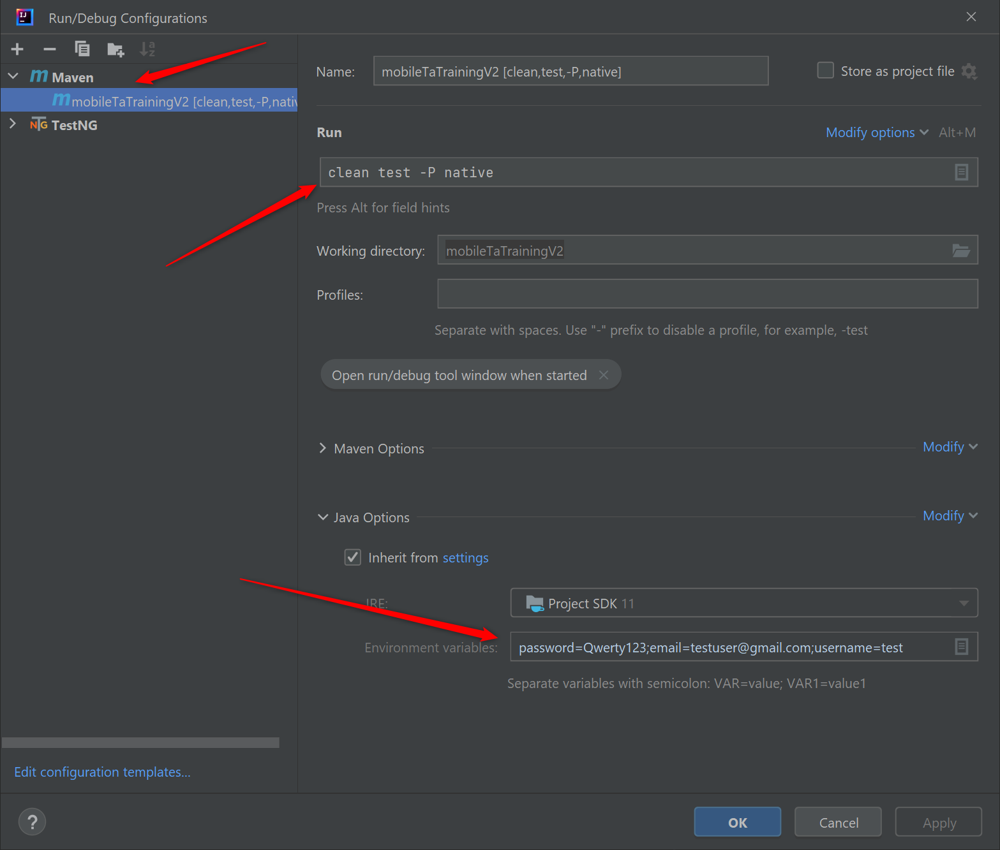

This framework tests two scenarios: the first is related to a native application (EPAMTestApp.apk), the second related to opening a web page in a browser.

To test a native application, you need to add environment variables ( email, username, password) at the maven level:

